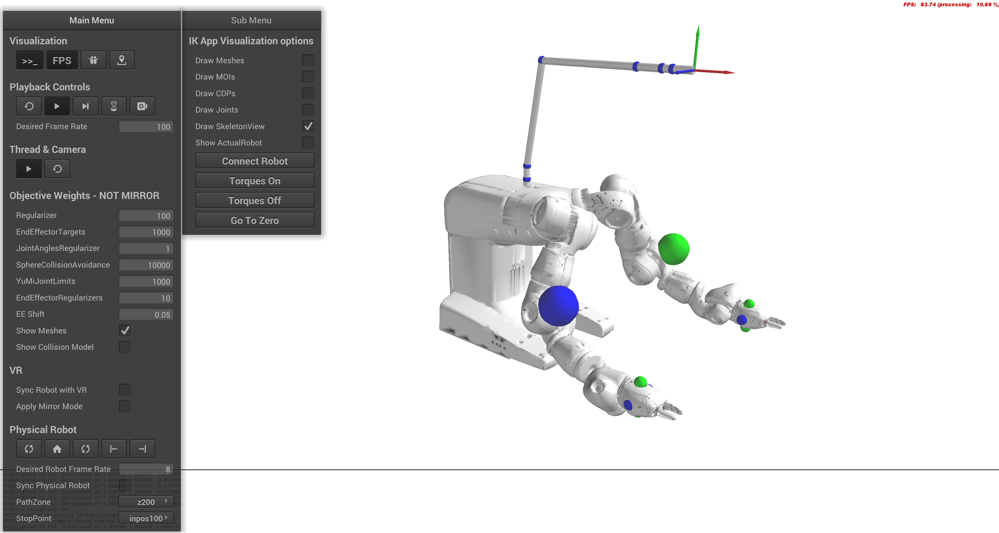

# MR Immersive Telemanipulation
Mixed Reality Lab, ETHZ, Fall 2019

  

The application/simulation to control YuMi is based on a proprietary backend that is written at Computational Robotics Lab (CRL), ETH Zurich. 

Therefore we can not share the code here. For more information or requests, please contact the authors of this repository.
